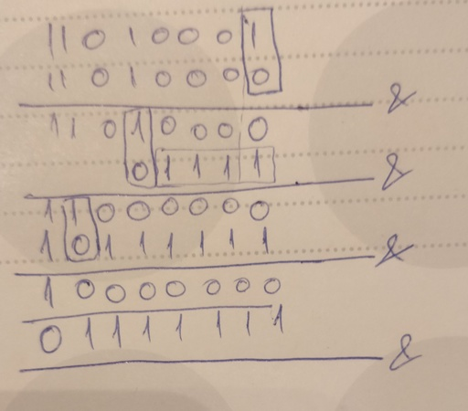

==============
Zombie Dev Log
==============

`Code sleeps here <https://github.com/radustoenescu/zombie-dev>`_

.. _day1:

Day 1 (Optimal matrix chain multiplication)
-------------------------------------------

Because I know pretty well the Hanoi tower problem, I started with
`Day 2 <https://medium.com/100-days-of-algorithms/day-2-matrix-chain-multiplication-3ae6349c34ab>`_.

The `Matrix chain multiplication <https://en.wikipedia.org/wiki/Matrix_chain_multiplication>`_
problem is a quite straightforward example of `Dynamic programming <https://en.wikipedia.org/wiki/Dynamic_programming>`_.

I implemented the basic algorithm. Wikipedia also points to a better algorithm, which I only skimmed over since
it's quite complex and well beyond what I'm doing here.

It took me:

    - thinking: 2m
    - coding: 17m
    - debugging: 9m
    - total: 28m

In future I think I can limit debugging greatly since I made some noob mistakes which required quite a bit of
looking around the code to fix, but the coding went smooth and I didn't search the documentation that much.

You can find the code in the `usual place <https://github.com/radustoenescu/zombie-dev>`_. Nothing fancy. Maybe
the ``@functools.lru_cache`` decorator is quite nice to check out since it makes memoization a lot easier to add.

.. _day2:

Day 2 (Counting set bits)
-------------------------

Given an ``int``, how many ones are there in its binary representation.

For example: ``0b00101`` -> 2; ``0b001011101`` -> 5. You got the idea, easy peasy.

.. code:: python

    def count_bits(n):
    count = 0
    while n > 0:
        count += n & 1
        n >>= 1
    return count

It works, but what the hell man?! That's kids stuff.

Right, of course you can do better than that:

.. code:: python

    def count_bits_wicked(n):
        count = 0
        while n > 0:
            n &= n - 1
            count += 1
        return count

*What?*

Yeah, that's what I thought when I first saw that. I hate bit twiddling.
I personally think it cripples the mind of any sane person.

However, this one above is pretty easy to grasp and understand if you
try it on a piece of paper.

Here, of course I did that for you:

*Rumour has it that every horizontal line is a bitwise and between the current n and n-1.
Except from the shortest one(second to last) which is a typo.*

So you can see how every and operation essentially knocks out one set bit at a time(*or one one*, if you prefer that).

Thus, the complexity is ``Theta(bits_set)`` as opposed to my solution which went through all
the bits every time, yielding ``Theta(bits)`` in complexity.

This second solution is not mine. On this `bit porn <https://graphics.stanford.edu/~seander/bithacks.html#CountBitsSetKernighan>`_ site you can learn more about it, and also find more
bit twiddling porn if you're into that.

*No times for this problem since the naive solution took me nothing, and the smart one is not mine.*

.. _day3:

Day 3 (The Sieve of Eratosthenes)
---------------------------------

**SPOILER ALERT: BOY ... IT WAS FUN!**

This belongs to `day 5 <https://medium.com/100-days-of-algorithms/day-5-eratosthenes-sieve-60ab162a1f5b>`_ in the original series.

Ok, this is a pretty simple algorithm, I remember implementing it for the first time in `highschool <https://www.facebook.com/Liceul-Teoretic-Alexandru-Ghica-Alexandria-830767510327046/>`_
in Pascal. What makes it simple is that, usually, people implement the, let's call it, *bounded Sieve* - which generates all the primes up to a limit, and, if the limit is reasonable one
can store the whole table in memory, and that's that - you just delete things from it, or mark things as non-prime.

Having said this, if you want to generate primes infinitely(*given a certain memory or time budget*), the problem gets more interesting - *this one I implemented in college, in Scheme,
or at least I thought so :)), but I'll stop with the spoilers now.* 

Well, my idea (the one I implemented in college) is to start with an infinite generator containing all natural numbers above 1. At each step you pop one out and filter out its multiples
from the generator. Easy-peasy, right?!

So, I came out with this Python3 code:

.. code:: python

    import itertools

    def sieve():
        # begin with all natural numbers above 1
        picker = itertools.count(2)
        while True:
            # take the next available number
            v = next(picker)
            yield v
            # filter from the generator its multiples
            picker = filter(lambda x: x % v != 0, picker)

Aaand it didn't work.

Furthermore, I had no frickin' clue why it didn't. I could see some weird behavior in the debugger - the generator's contents were wrong - but I didn't knew why.

I got a little paranoid, and started doubting I knew the solution, so I double checked by quickly implementing it in Haskell:

.. code:: haskell

    sieve remaining = nextItem : sieve (filter (\x -> x `mod` nextItem /= 0) remaining)
        where
            nextItem = head remaining

And that one worked. Now I was really puzzled since the Python code was a mere translation of the one in Haskell, I thought maybe I don't understand the inner workings of infinite
generators in Python and the ``filter`` method
`so I asked on Stackoverflow <https://stackoverflow.com/questions/55966499/troublesome-filter-behavior-when-implementing-the-sieve-of-eratosthenes-in-pyt>`_.
I found out there that lambdas in Python `don't work as I expected <https://stackoverflow.com/questions/2295290/what-do-lambda-function-closures-capture>`_
(as they do in most functional programming languages).

The fix is below:

``picker = filter(lambda x, prime = v: x % prime != 0, picker)``

Already this was proving more educative than it looked like in the beginning. But the really fun part starts now. While I was waiting for some light on Stackoveflow, I also
looked on Wikipedia for more insight, especially at the, so called,  `iterative sieve <https://en.wikipedia.org/wiki/Sieve_of_Eratosthenes#Incremental_sieve>`_ where I found this:

*Primes can also be produced by iteratively sieving out the composites through divisibility testing by sequential primes, one prime at a time. It is not the sieve of Eratosthenes but is often confused with it,
even though the sieve of Eratosthenes directly generates the composites instead of testing for them.
Trial division has worse theoretical complexity than that of the sieve of Eratosthenes in generating ranges of primes.*

**BAM!** I wasn't implementing the true algorithm(nor was I back in college). A thing which is pretty clear, now, in retrospect. `My version <http://eprints.whiterose.ac.uk/3784/1/runcimanc1.pdf>`_,
which is also pretty famous due to its beautiful implementation, doesn't jump from one multiple to another, simply checks one number after another if it is a multiple(*a pretty bad thing,
but more on that later*). So famous, that I even found a paper about the `"unfaithful" vs. the genuine sieve <https://www.cs.hmc.edu/~oneill/papers/Sieve-JFP.pdf>`_.

**Short recap:** at this point I have a working version of the wrong algorithm that generates primes indefinitely. Next, let's code the genuine sieve. 
 
.. code:: python

    import heapq
    # In the proper sieve we will cross multiples as we go,
    # For each prime we found we'll keep its largest multiple generated
    # that wasn't reached so far in our search.
    #
    # When our iteration reaches a multiple, it gets popped and the next
    # multiple is inserted in the heap.
    def proper_sieve():
        yield 2
        crt_number = 3
        multiples = [(4,2)]

        while True:
            next_multiple = multiples[0]
            # if the next smalles multiple is larger than the number we're currently looking at
            # then all the numbers between the two are primes
            # we'll report them as such and add their first multiples to the queue
            if next_multiple[0] > crt_number:
                for n in range(crt_number, next_multiple[0]):
                    yield n
                    heapq.heappush(multiples, (n * n, n))
                crt_number = next_multiple[0]
            else:
                # otherwise, the current number is not a prime, and we'll pop it
                # from the queue, and add the next multiple to the queue
                while next_multiple[0] == crt_number:
                    heapq.heappop(multiples)
                    heapq.heappush(multiples, (next_multiple[0] + next_multiple[1], next_multiple[1]))
                    next_multiple = multiples[0]
                crt_number += 1

Now you see why it's so easy to fall for the "unfaithful" sieve. This version is much more verbose and contrived, but it has a plus - *it's not a different algorithm*.

And, yeah, it has another plus - it's much faster than the first.

I printed the first 100 000 primes using both algorithms running:

``/usr/bin/time -v python3 sieve.py > out``

Granted this is not the most reliable way of carrying out a micro benchmark, you can check out `the code <https://github.com/radustoenescu/zombie-dev/blob/master/my-100days/sieve.py>`_ - which is in the usual place - and test them yourselves, perhaps
using a more exact tool such as `timeit <https://docs.python.org/3/library/timeit.html>`_.

The difference was huge: 10 minutes vs. 3 seconds. The memory consumption was also halved.

It took me 6 minutes to code the thing and 5 minutes to test and fix some small problems. It uses one well-known optimization: the first multiple to consider for each prime is the prime squared,
instead of the prime doubled(you can see why this works with a pen and paper by stepping through the unoptimized version of the algorithm a couple of times, or by checking Wikipedia). You can do better,
for instance avoiding even numbers since they are clearly not primes, and occur often, *maybe in the future I'll look into it a bit deeper*.

The general idea of the algorithm sits in the comments of the code, further details you can find in the `paper <https://www.cs.hmc.edu/~oneill/papers/Sieve-JFP.pdf>`_ I mentioned.

On rosetta code you can find `another implementation <https://rosettacode.org/wiki/Sieve_of_Eratosthenes#Infinite_generator>`_ of the same algorithm, which is cleaner, but marginally slower.